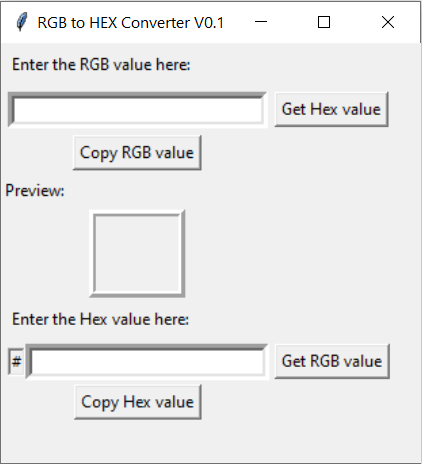

# RGB-to-HEX 🎨

It is a Python based Tkinter GUI Application that can convert a given Colour sequence from RGB to HEX and Vice versa as well as show the visual output of the color in preview section

## The Need
RGB and Hex Colour codes have their unique advantages. But sometimes while designing a website Hex Colours are highly used due to their very uniform and compactness.

This program utilizes the Python Tkinter module for the GUI and the individual values are picked by python slicing

  

Some examples:

  

  

